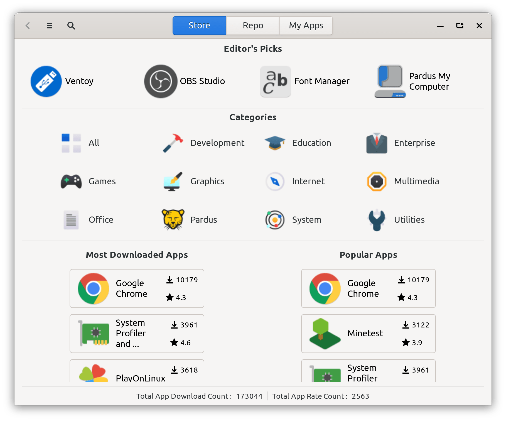
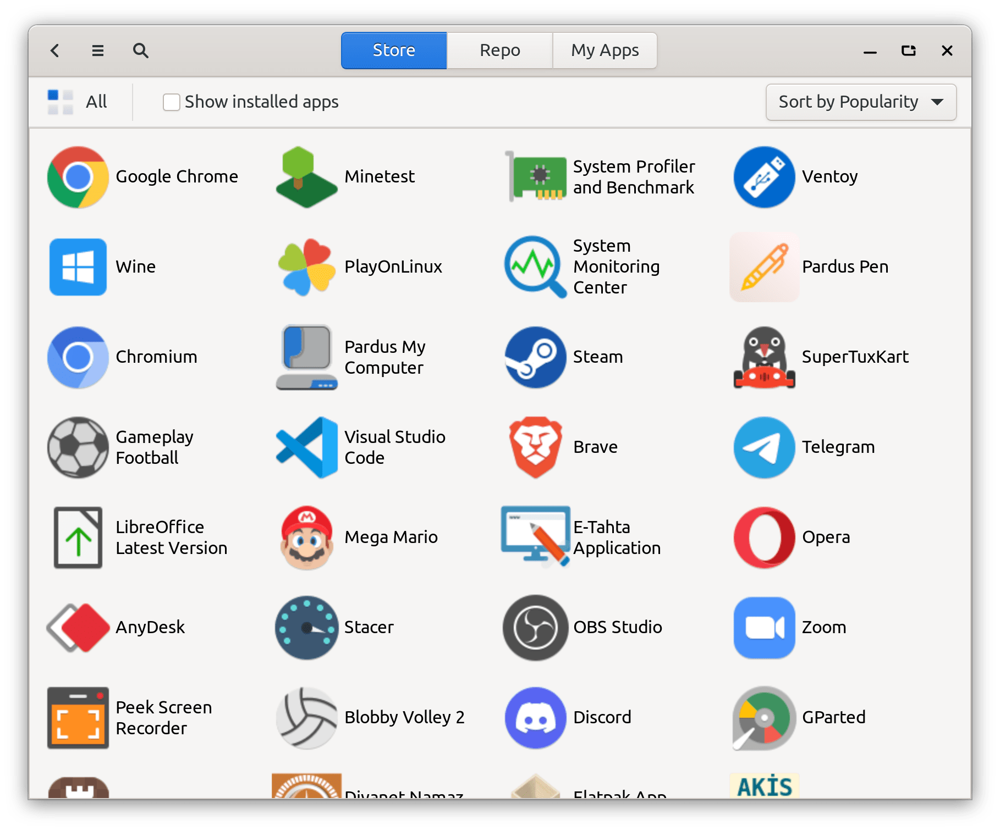
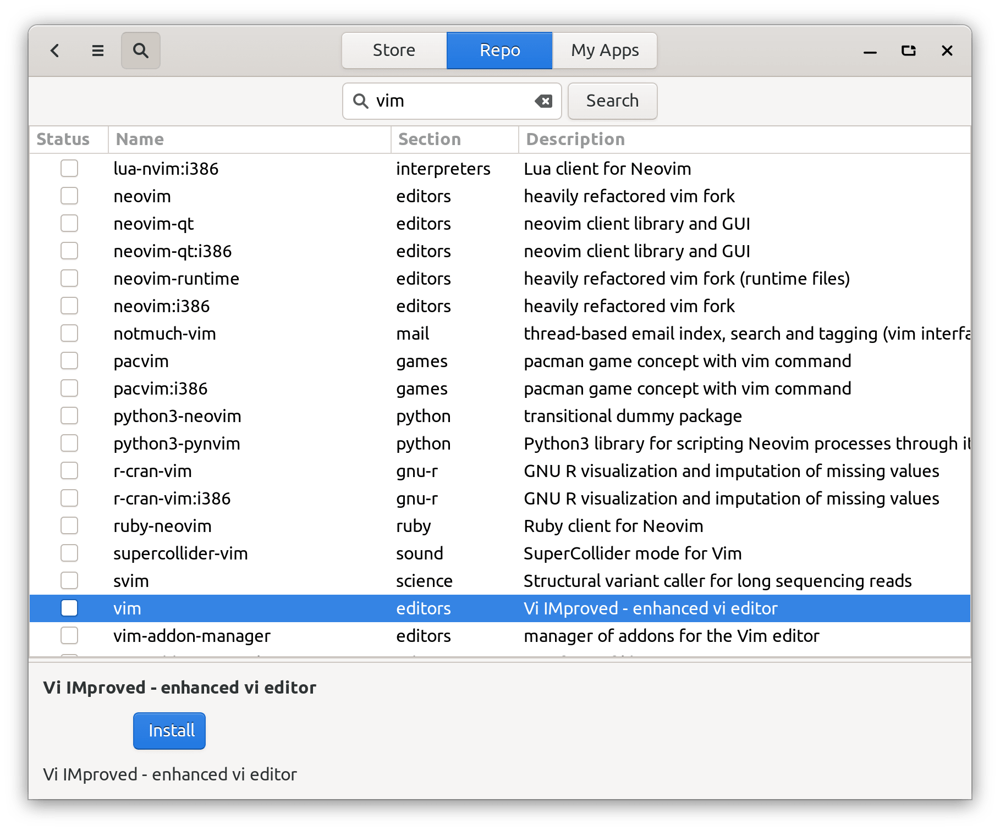
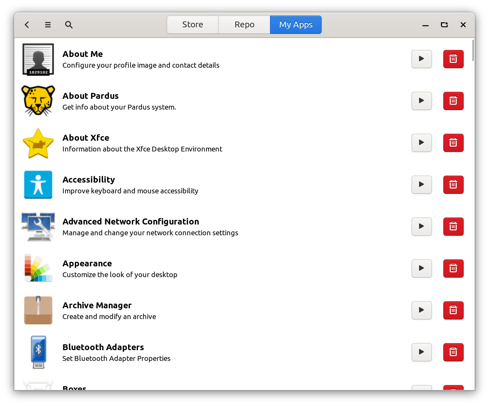
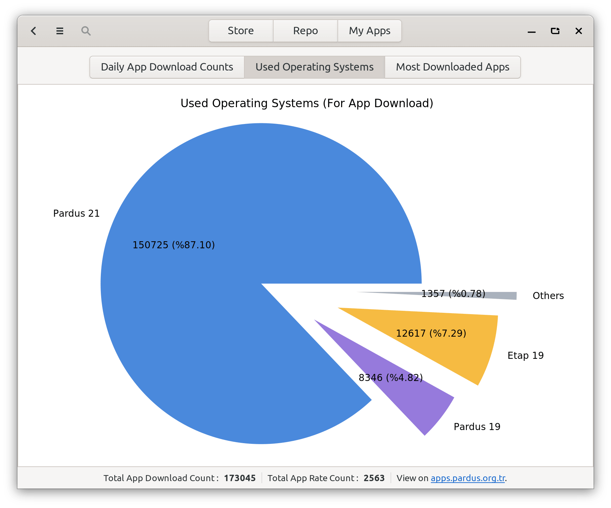

# Pardus Software Center

Pardus Software Center is a software center front-end for debian based operating systems.

It is currently a work in progress. Maintenance is done by <a href="https://www.pardus.org.tr/">Pardus</a> team.

You can see the web interface of the application center at <a href="https://apps.pardus.org.tr/">Pardus Apps</a>.

## Dependencies:

* This application is developed based on Python3 and GTK+ 3. Dependencies:
   - ```gir1.2-glib-2.0 gir1.2-gtk-3.0 gir1.2-notify-0.7 gir1.2-soup-2.4 gir1.2-vte-2.91 gvfs gvfs-backends python3-apt python3-distro python3-matplotlib python3-netifaces python3-psutil python3-requests```

## Run Application from Source

* Install dependencies :
    * ```sudo apt install gir1.2-glib-2.0 gir1.2-gtk-3.0 gir1.2-notify-0.7 gir1.2-soup-2.4 gir1.2-vte-2.91 gvfs gvfs-backends python3-apt python3-distro python3-matplotlib python3-netifaces python3-psutil python3-requests```
* Clone the repository :
    * ```git clone https://github.com/pardus/pardus-software.git ~/pardus-software```
* Run application :
    * ```python3 ~/pardus-software/src/main.py```

## Build deb package

* `sudo apt install devscripts git-buildpackage`
* `sudo mk-build-deps -ir`
* `gbp buildpackage --git-export-dir=/tmp/build/pardus-software -us -uc`

## Screenshots











