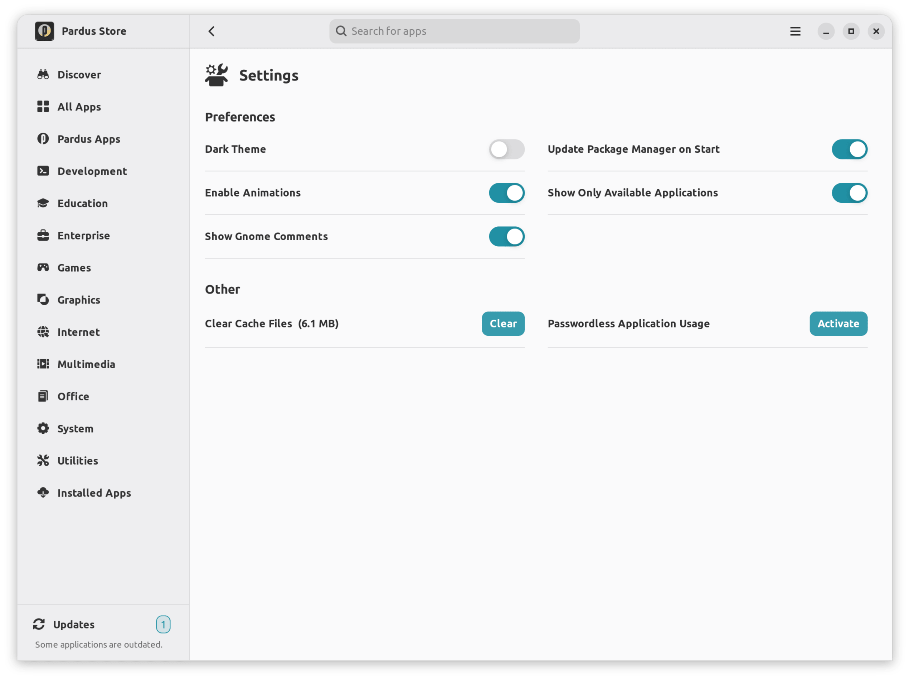

# Pardus Software Center

Pardus Software Center is a software center front-end for debian based operating systems.

It is currently a work in progress. Maintenance is done by <a href="https://www.pardus.org.tr/">Pardus</a> team.

You can see the web interface of the application center at <a href="https://apps.pardus.org.tr/">Pardus Apps</a>.

[](https://repology.org/project/pardus-software/versions)

### **Dependencies**

This application is developed based on Python3 and GTK+ 3. Dependencies:
```bash
gir1.2-glib-2.0 gir1.2-gtk-3.0 gir1.2-notify-0.7 gir1.2-soup-2.4 gir1.2-vte-2.91 gvfs gvfs-backends python3-apt python3-cairo python3-distro python3-netifaces python3-psutil
```

### **Run Application from Source**

Install dependencies
```bash
sudo apt install gir1.2-glib-2.0 gir1.2-gtk-3.0 gir1.2-notify-0.7 gir1.2-soup-2.4 gir1.2-vte-2.91 gvfs gvfs-backends python3-apt python3-cairo python3-distro python3-netifaces python3-psutil
```
Clone the repository
```bash
git clone https://github.com/pardus/pardus-software.git ~/pardus-software
```
Run application
```bash
python3 ~/pardus-software/src/Main.py
```

### **Build deb package**

```bash
sudo apt install devscripts git-buildpackage
sudo mk-build-deps -ir
gbp buildpackage --git-export-dir=/tmp/build/pardus-software -us -uc
```

### **Screenshots**



